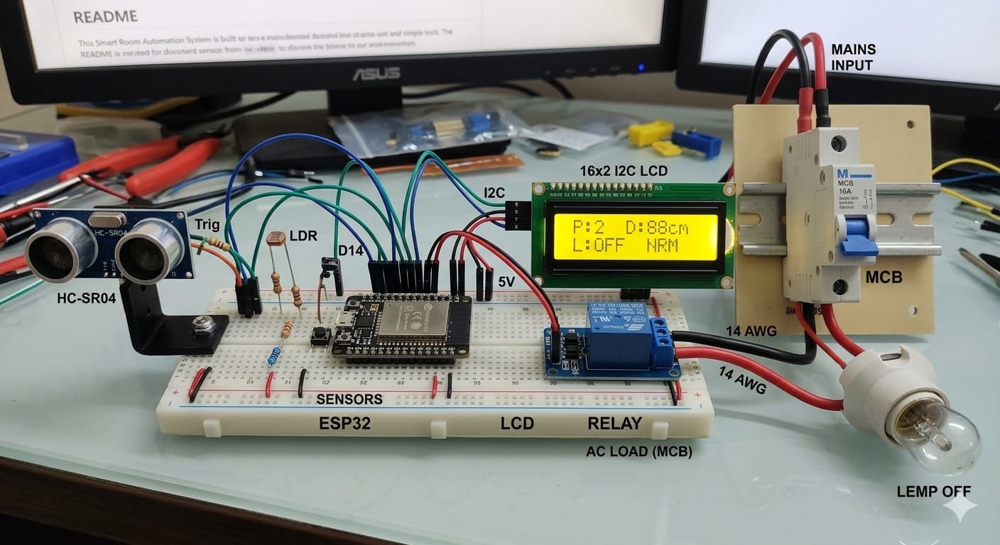
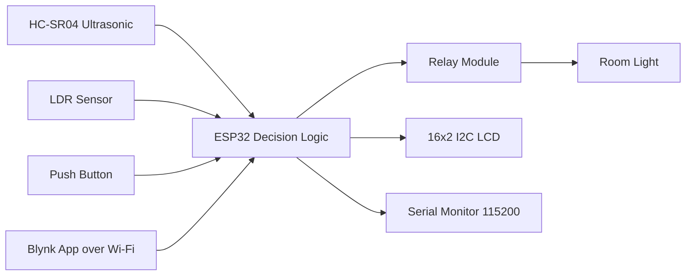

# Smart Room Automation System

<p align="center">
	<b>ESP32-powered intelligent room lighting with occupancy trends, adaptive light sensing, and IoT remote control.</b>
</p>

<p align="center">
	
	
	
	
</p>

## Overview

This project is a practical single-room automation prototype developed by Team 7 (IIIT Dharwad, AY 2025-2026). It uses an ESP32 to combine:

- occupancy estimation from ultrasonic distance trends,
- ambient brightness sensing via LDR,
- local user controls with a physical button,
- remote control and mode toggles through Blynk.

The goal is straightforward: turn lights on only when needed, preserve user control, and reduce energy waste.

## Demo Behavior

- A person enters in a dark room -> occupancy increases -> light turns ON.
- A person exits and count reaches zero -> light turns OFF (unless Study Mode is active).
- Sleep Mode -> light stays OFF.
- Local and app controls can override normal sensor flow.

## Project Preview

- LCD status view image path: `docs/images/lcd-status.jpg`
- Hardware setup image path: `docs/images/hardware-setup.jpg`
- Blynk dashboard screenshot path: `docs/images/blynk-dashboard.jpg`

Example markdown you can enable after adding images:

```markdown



```

## System Architecture



### Layered View

- Input Layer: HC-SR04, LDR, push button, Blynk virtual inputs.
- Decision Layer: trend detection, occupancy count, mode arbitration.
- Output Layer: relay switching for room light.
- Feedback Layer: LCD status and serial diagnostics.

## Key Features

- Trend-based entry/exit detection (no PIR dependency)
- Median-filtered ultrasonic readings for noise reduction
- Cooldown timer to avoid repeated false events
- Occupancy-aware auto-lighting with ambient threshold check
- Manual short-press toggle and long-press Study Mode
- Blynk-based remote mode control
- LCD mode/status display with entry/exit animation

## Hardware Stack

- ESP32 Dev Board
- HC-SR04 Ultrasonic Sensor
- LDR (analog ambient sensing)
- 5V Single Channel Relay
- 16x2 I2C LCD (0x27)
- Push button (internal pull-up logic)

### Safety Note

HC-SR04 Echo is 5V while ESP32 GPIO is 3.3V logic. Use a voltage divider (report example: $2k\Omega + 1k\Omega$) before the Echo pin input.

## Pin Mapping

Implemented in [main.ino](main.ino):

| Signal | GPIO |
|---|---:|
| TRIG_PIN | 5 |
| ECHO_PIN | 18 |
| RELAY_PIN | 4 |
| BUTTON_PIN | 14 |
| LDR_PIN | 34 |

## Wiring Diagram

- Recommended file path for diagram: `docs/wiring/wiring-diagram.png`
- Keep one clean labeled wiring image that maps every GPIO in the table above.

Example markdown:

```markdown

```

## Firmware Logic

### Occupancy Direction Inference

The firmware keeps a rolling 5-sample distance history.

- strictly increasing trend -> treated as entry event
- strictly decreasing trend -> treated as exit event

Combined with median filtering and trigger cooldown, this improves reliability against noisy spikes.

### Lighting Rules

- Entry: increment count; if dark (`LDR < DARK_THRESHOLD`), turn light ON.
- Exit: decrement count (clamped at 0).
- If count is 0 and Study Mode is OFF, turn light OFF.

### Mode Priority (Current Code Behavior)

1. Manual user actions (button and app toggles)
2. Study Mode (forces ON unless Sleep Mode is active)
3. Sleep Mode (forces OFF)
4. Normal occupancy + LDR logic

Report alignment note: The report mentions NTP-scheduled sleep windows (23:00-06:00). The current code does not yet implement NTP sleep scheduling; Sleep Mode is currently controlled through Blynk (`V2`).

## Blynk Mapping

- `V0` -> Study Mode toggle
- `V2` -> Sleep Mode toggle

## LCD UX

- Main line 1: `P:<count> D:<distance>cm`
- Main line 2: `L:<ON/OFF> <mode>`
- Mode labels: `SLP`, `STD`, `NRM`
- Event animations: `>> ENTER >>`, `<< EXIT <<`

## Quick Start

1. Install Arduino IDE (or PlatformIO) and ESP32 board support.
2. Install libraries used in [main.ino](main.ino):
	 - `WiFi.h`
	 - `BlynkSimpleEsp32.h`
	 - `Wire.h`
	 - `LiquidCrystal_I2C.h`
3. Open [main.ino](main.ino).
4. Update credentials/tokens:
	 - `BLYNK_TEMPLATE_ID`
	 - `BLYNK_TEMPLATE_NAME`
	 - `BLYNK_AUTH_TOKEN`
	 - `ssid`
	 - `pass`
5. Wire components using the pin table above.
6. Upload to ESP32.
7. Open Serial Monitor at `115200` and verify sensor logs + LCD updates.

## Troubleshooting

- Problem: No reading from HC-SR04 (`-1` distance often).
	- Check TRIG/ECHO wiring and shared GND.
	- Confirm Echo pin is level-shifted/divided to 3.3V for ESP32.
	- Verify sensor has stable 5V supply.
- Problem: Random resets or unstable behavior.
	- Avoid powering heavy loads from ESP32 board pins.
	- Use a stable external supply and proper common ground.
	- Isolate relay supply noise if needed.
- Problem: Light does not turn ON in Auto behavior.
	- Check ambient value versus `DARK_THRESHOLD`.
	- Validate relay module logic polarity (active HIGH/LOW type).
	- Confirm occupancy count is increasing on entry events.
- Problem: Blynk controls not responding.
	- Verify Wi-Fi credentials and internet access.
	- Confirm correct Blynk template/auth token.
	- Ensure virtual pins match firmware (`V0`, `V2`).
- Problem: LCD not displaying text.
	- Recheck I2C address (common: `0x27`/`0x3F`).
	- Confirm SDA/SCL pins for your ESP32 board variant.
	- Test LCD power and contrast adjustment.

## Repository Structure

- [main.ino](main.ino) - ESP32 firmware source
- [README.md](README.md) - project documentation

## Challenges Solved (From Report)

- Echo-pin voltage protection for ESP32 safety
- Power-distribution improvements after random shutdowns
- Priority fixes to prevent automatic logic from overriding user intent

## Roadmap

- DS3231 RTC for offline timekeeping
- NTP/RTC-backed scheduled Sleep Mode
- FreeRTOS migration for non-blocking task handling
- Voice control integration (Alexa/Google Home)
- OLED interface upgrade
- Multi-room support and usage analytics

## Security Reminder

Never publish real Wi-Fi credentials or Blynk tokens in public repositories. Replace them with placeholders before pushing code.

## Credits

Team 7, IIIT Dharwad  
Academic Year 2025-2026
